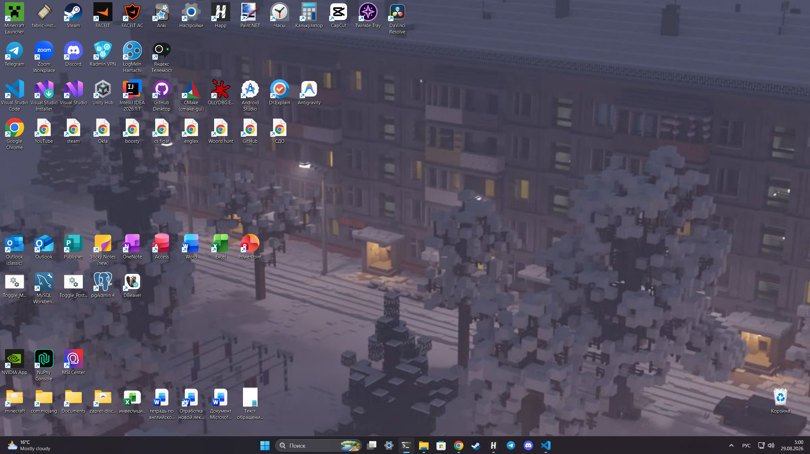
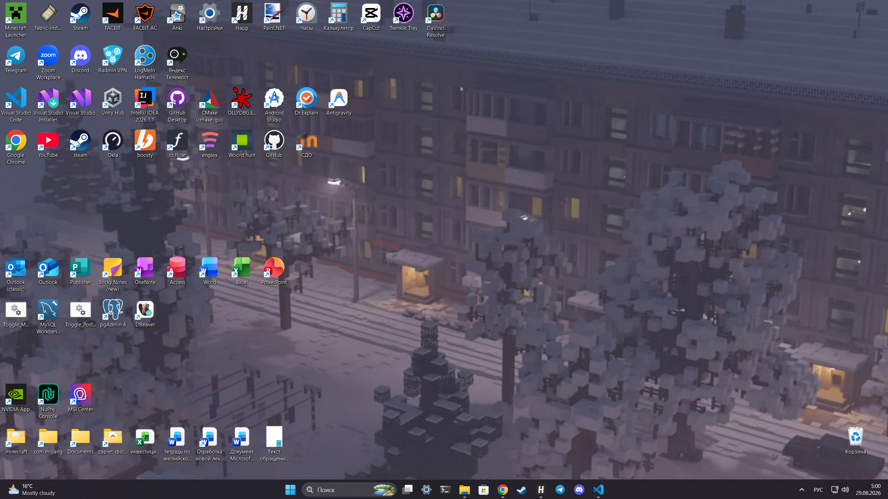
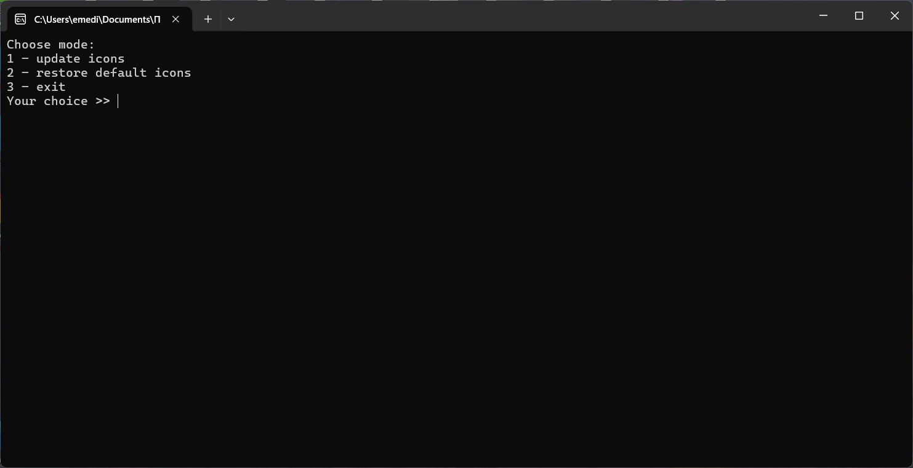

# Desktop Internet Shortcut Icons Auto Updater

Утилита для Windows, которая автоматически обновляет иконки интернет-ярлыков на рабочем столе. 

Пользователи Windows, которые активно используют ярлыки сайтов, могут столкнуться с проблемой: множество ярлыков имеют одинаковые стандартные иконки браузера и отличаются только названием. Данная программа решает эту проблему, заменяя стандартные изображения ярлыков на иконки, соответствующие сайтам, на которые они ведут.

## Пример работы

### До использования программы

### После использования программы

## Использование

После запуска программы появится меню с доступными режимами.

### 1. Обновление иконок

Первый режим скачивает и устанавливает иконки для интернет-ярлыков, находящихся на рабочем столе.

В зависимости от скорости интернет-соединения, времени ответа сайтов и количества интернет-ярлыков процесс может занять до нескольких минут.

Не все ярлыки могут быть обновлены с первого раза, поскольку некоторые сайты могут не отвечать на запросы программы. Если после завершения работы некоторые ярлыки остались без новых иконок, можно повторить попытку. Также можно попробовать выполнить обновление позже.

### 2. Восстановление стандартных иконок

Второй режим восстанавливает стандартные иконки интернет-ярлыков.

Этот режим следует использовать, если вы хотите отказаться от использования программы, если некоторые ярлыки отображаются некорректно или если необходимо удалить утилиту.

После восстановления стандартных иконок программу можно удалить.

## Важная информация

После обновления иконок не рекомендуется сразу удалять или перемещать программу.

Скачанные иконки хранятся непосредственно в папке утилиты, а ярлыки сохраняют пути к этим файлам. Если удалить программу или переместить её в другое место, Windows больше не сможет найти сохранённые иконки. В результате вместо них могут отображаться стандартные изображения, обозначающие отсутствующую иконку.

Поэтому перед первым запуском рекомендуется выбрать постоянное место для утилиты.

Если программу всё же необходимо переместить, после перемещения можно повторно запустить первый режим — иконки будут загружены заново с учётом нового расположения программы.

Если вы хотите полностью удалить программу, сначала запустите второй режим и восстановите стандартные иконки. После этого утилиту можно удалить без риска оставить в ярлыках пути к несуществующим файлам.
