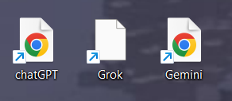

# Desktop Internet Shortcut Icons Auto Updater

A Windows utility that automatically updates icons of web shortcuts located on the desktop.

Windows users who actively use website shortcuts may encounter a problem: many shortcuts have the same default browser icon and differ only by their names. This program solves this issue by replacing default shortcut images with icons corresponding to the websites they point to.

## Example

### Before using the program

### After using the program

## Usage

After launching the program, a menu with available modes will appear.

### 1. Update icons

The first mode downloads and assigns icons to web shortcuts located on the desktop.

Depending on the internet connection speed, website response times, and the number of web shortcuts, the process may take several minutes.

Not all shortcuts may be updated successfully on the first attempt, as some websites may not respond to the program's requests. If some shortcuts remain without new icons after completion, you can try again. You can also retry the update later.

This mode requires an internet connection.

### 2. Restore default icons

The second mode restores the default icons of web shortcuts.

This mode should be used if you want to stop using the program, if some shortcuts are displayed incorrectly, or if you want to remove the utility.

After restoring the default icons, the program can be safely deleted.

## Important information

After updating icons, it is not recommended to immediately delete or move the program.

Downloaded icons are stored directly inside the utility folder, and shortcuts keep paths to these files. If the program is deleted or moved to another location, Windows will no longer be able to find the stored icons. As a result, default missing-icon images may be displayed instead.

Therefore, it is recommended to choose a permanent location for the utility before the first launch.

If the program needs to be moved, you can run the first mode again after moving it. The icons will be downloaded again using the new program location.

If you want to completely remove the program, first run the second mode and restore the default icons. After that, the utility can be deleted without leaving shortcuts pointing to non-existent files.

## System requirements

The only requirement:

* Windows 11

## Installation and launch

No installation is required.

Download the latest build of the program from the [Releases](https://github.com/Emedim/Desktop-internet-shortcut-icons-auto-updater/releases/) section and extract the archive to a convenient location.

To launch the program, open the `bin` folder and run `DISIAU.exe` by double-clicking it.

After launch, a menu with available operation modes will appear.

## Limitations and known issues

The program does not guarantee successful icon updates for all web shortcuts.

Some websites may not provide the required data or may refuse to process requests from the program. In such cases, the corresponding shortcut icon will not be updated, and the default icon will remain unchanged.

Some websites may also specify an incorrect type of downloaded image. As a result, the program may save the received data in a format that Windows cannot use as an icon. In this case, a default blank-file icon may be displayed instead of the website icon.

## License

This project is licensed under the MIT License.

Copyright (c) 2026 Andrey Melnikov

## Third-party components

This project uses third-party libraries distributed under their own licenses.

See `THIRD-PARTY-NOTICES.txt` for details.